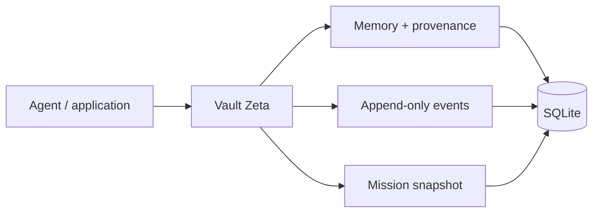

# Vault Zeta 🌠

Most AI systems are getting better at reasoning, but they still have a continuity problem.

Close the session, change the model, move to another machine, or come back a month later and a lot of useful context disappears. My interest in Vault Zeta started there.

**Vault Zeta is an experimental continuity layer for long-running AI systems.**

Not “infinite memory”. Not a magic brain dump. The goal is much more practical: keep useful state, where it came from, how confident we are in it, whether the source has changed, and what happened during a long-running mission.

I sometimes call it **the daddy of the future** 😅🌠. The repository is where that joke has to survive contact with code.



The storage is intentionally boring right now. I want the continuity model to be understandable before making it distributed, embedded, or clever.

## What exists today

The first public alpha is deliberately small. It includes:

- SQLite-backed durable memory
- memory kinds such as episodic, semantic, procedural, failure, entity and preference
- scope, provenance and confidence on memory records
- source fingerprints and stale-memory marking
- lexical retrieval with SQLite FTS5
- an append-only mission event journal
- durable mission snapshots with optimistic revision checks
- JSON metadata instead of hidden in-memory state
- tests for the core persistence and continuity behavior

The important rule is:

> **Memory is context, not permission.**

Remembering that someone approved an action yesterday must never become authority to repeat that action today.

## Why this is separate from an agent

Vault Zeta is not meant to be another coding agent or chatbot.

Scrappy Forge can be one of the systems that *uses* continuity. CANOPY can eventually use it for long-running environmental missions. Other agents should be able to use the same layer without inheriting each other's authority.

That separation matters to me.

## Quick start

Requires Python 3.11+.

```bash
git clone https://github.com/getkcoin-alt/vault-zeta.git
cd vault-zeta

python3 -m venv .venv
source .venv/bin/activate
python -m pip install -e '.[dev]'

pytest
python examples/quickstart.py
```

Minimal usage:

```python
from vault_zeta import VaultZetaStore

with VaultZetaStore("zeta.db") as zeta:
    memory = zeta.add_memory(
        kind="semantic",
        content="The greenhouse irrigation controller uses zone-level moisture targets.",
        scope="canopy/greenhouse",
        source="docs/irrigation.md",
        source_fingerprint="sha256:example",
        confidence=0.95,
    )

    hits = zeta.search("irrigation moisture", scope="canopy/greenhouse")

    seq = zeta.append_event(
        mission_id="mission-42",
        event_type="observation",
        payload={"sensor": "soil-7", "moisture": 0.22},
    )

    revision = zeta.save_mission(
        "mission-42",
        status="running",
        snapshot={"next_step": "review irrigation threshold"},
    )
```

## Current model

A memory record stores:

- `kind`
- `content`
- `scope`
- `source`
- `source_fingerprint`
- `confidence`
- `metadata`
- timestamps
- stale/fresh state

A mission has an append-only event stream plus a replaceable snapshot. The event stream answers *what happened*. The snapshot answers *where should I resume*. Both are intentionally boring data structures.

That is a feature.

See [ARCHITECTURE.md](ARCHITECTURE.md) for the current boundaries.

## What Vault Zeta is not

At this stage it is **not**:

- a vector database
- a consciousness claim
- an identity replacement mechanism
- an authorization system
- a distributed database
- a guaranteed truth store
- production-ready infrastructure

The current alpha gives us a clean place to test continuity mechanisms before adding more intelligence around them.

## Where this is going

The next useful steps are:

- optional embedding adapters without making embeddings mandatory
- entity links and relationship history
- resumable task-graph primitives
- correction/supersession semantics
- import/export with provenance preserved
- retrieval evaluation instead of “memory feels good”
- encryption options for sensitive local stores
- adapters for Scrappy Forge and CANOPY
- long-duration simulations that deliberately test stale and conflicting memory

See [ROADMAP.md](ROADMAP.md).

## Contributing

Contributions are welcome.

If this problem interests you, start with [CONTRIBUTING.md](CONTRIBUTING.md) and the open issues. I would especially like help from people interested in agent memory, databases, provenance, retrieval evaluation, distributed systems and safety boundaries.

Please do not submit real private memories, credentials, customer data or personal datasets as test fixtures.

## Related work

- Scrappy Forge: https://github.com/getkcoin-alt/scrappy_forge
- Scrappy OS: https://github.com/getkcoin-alt/-scrappy-os
- Karnveer: https://karnveer.com

---

Built around a simple belief: **intelligence without continuity keeps relearning the same life.**


## License

Apache License 2.0 — see [LICENSE](LICENSE).
